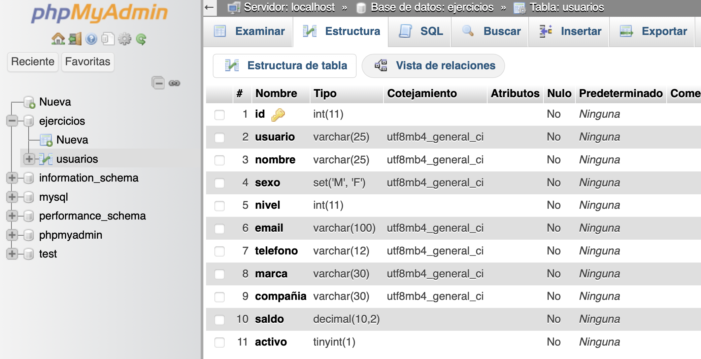
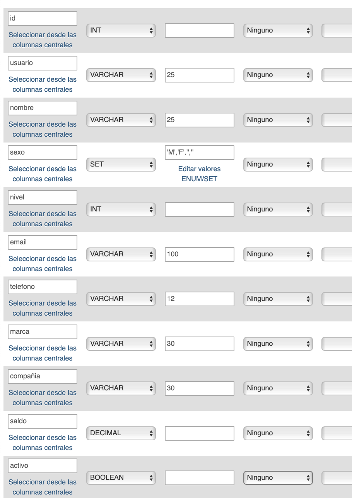
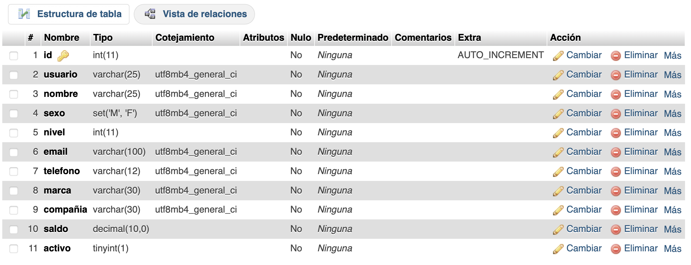

# XAMPP 

Descargar instalador de la web de XAMPP > https://www.apachefriends.org/es/download.html

Una vez instalado, iniciamos Apache y MySQL con `Start` (ambos deben quedar en verde tras unos segundos)

Una vez iniciados, podemos abrir:
- http://localhost/dashboard/
- http://localhost/phpmyadmin/index.php

Dentro de phpMyAdmin podemos crear base de datos desde el panel izquierdo



También podemos crear tablas



```sql
CREATE TABLE `ejercicios`.`usuarios` 
  (`id` INT NOT NULL AUTO_INCREMENT , 
  `usuario` VARCHAR(25) NOT NULL , 
  `nombre` VARCHAR(25) NOT NULL , 
  `sexo` SET('M','F') NOT NULL , 
  `nivel` INT NOT NULL , 
  `email` VARCHAR(100) NOT NULL , 
  `telefono` VARCHAR(12) NOT NULL , 
  `marca` VARCHAR(30) NOT NULL , 
  `compañia` VARCHAR(30) NOT NULL , 
  `saldo` DECIMAL(10,2) NOT NULL , 
  `activo` BOOLEAN NOT NULL , 
  PRIMARY KEY (`id`)) 
  ENGINE = InnoDB;
```



Y podemos ejecutar SQL en la db de MySQL:

```sql
INSERT INTO `usuarios` (`id`, `usuario`, `nombre`, `sexo`, `nivel`, `email`, `telefono`, `marca`, `compañia`, `saldo`, `activo`) VALUES (NULL, 'test_user', 'Test User', 'M', '1', 'email@email.xyz', '012', 'Sony', 'AT&T', '49', '1');
```